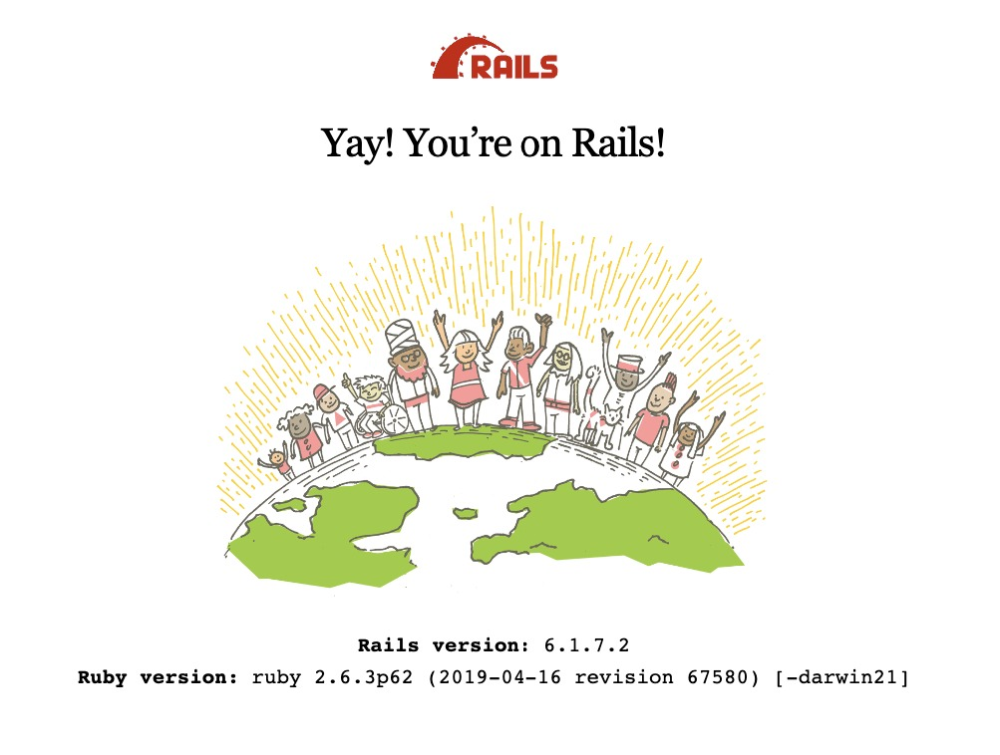

This README would normally document whatever steps are necessary to get the
application up and running.

Things you may want to cover:

* Rails version: 6.1.7.2

* Ruby version: 3.0.1

* Node version: 16.14.0

* System dependencies

* Configuration

* Database creation

* Database initialization

* How to run the test suite

* Services (job queues, cache servers, search engines, etc.)

* Deployment instructions

* ...
